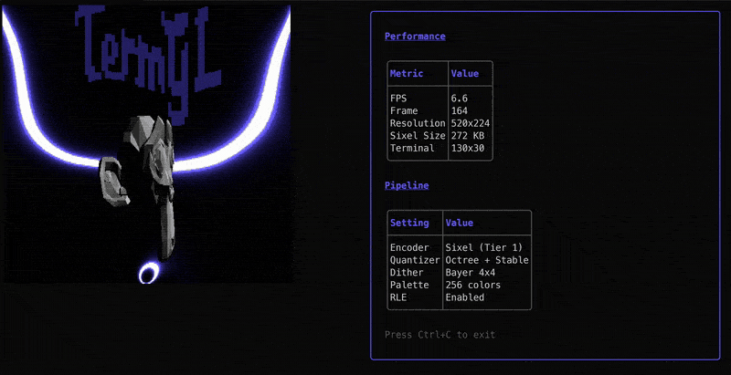

# TermGL

A 2D/3D graphics rendering library for terminal user interfaces in Go. Built for the [Charm](https://charm.sh) ecosystem.



*Suzanne OBJ model rendered in the terminal at 30fps*

## Features

### Cell-Based Rendering (ASCII)
- **4-Layer Architecture**: Canvas -> 2D Primitives -> 3D Pipeline -> Animation
- **Full 3D Pipeline**: Perspective projection, scanline rasterization, Z-buffering
- **ASCII Shading**: Flat and smooth (Gouraud) shading with configurable luminance ramps
- **Render Modes**: Shaded, wireframe, solid, outlined, depth visualization

### Pixel-Based Rendering (Two-Tier Pipeline)
- **FauxGL Software Rasterizer**: Full 3D rendering to `image.NRGBA` framebuffers via a scene graph with node hierarchy, camera, and lighting
- **Tier 1 - Sixel Output**: Adaptive octree quantization, stable palette animation (no flicker), Sixel encoding with RLE, ordered Bayer dithering for smooth gradients
- **Tier 2 - ANSI Subpixel Output**: Pluggable blitters (half-block, quadrant, sextant, braille), frequency splitting (Y/Cb/Cr decomposition), edge-aware character selection using depth buffers, delta encoding for bandwidth reduction
- **Auto-Detection**: Automatically selects the best output tier based on terminal capabilities

### Shared
- **OBJ Loading**: Load 3D models from Wavefront OBJ files
- **Bubble Tea Integration**: Use as a standard `tea.Model` component
- **Harmonica Springs**: Physics-based animation for smooth motion
- **Pure Go**: No CGo, cross-compiles everywhere Go runs

## Installation

```bash
go get github.com/charmbracelet/termgl
```

## Quick Start

### Pixel Rendering (Auto-Detect)

Automatically selects Sixel or ANSI output based on your terminal:

```go
package main

import (
    "fmt"
    "os"

    tea "github.com/charmbracelet/bubbletea"
    "github.com/charmbracelet/termgl"
    "github.com/charmbracelet/termgl/render"
    "github.com/charmbracelet/termgl/tier1"
    "github.com/charmbracelet/termgl/tier2"
    "github.com/fogleman/fauxgl"
)

func main() {
    // Load mesh
    mesh, err := render.LoadOBJ("models/suzanne.obj")
    if err != nil {
        fmt.Fprintln(os.Stderr, err)
        os.Exit(1)
    }
    mesh.BiUnitCube()

    // Build scene
    scene := render.NewScene()
    meshNode := render.NewMeshNode(mesh)
    scene.Root.AddChild(meshNode)

    scene.Camera.SetPosition(0, 0, 3)
    scene.Camera.SetTarget(0, 0, 0)

    scene.Lights = append(scene.Lights,
        render.NewDirectionalLight(0.5, 0.5, 1,
            fauxgl.Color{R: 1, G: 1, B: 1, A: 1}, 0.8))
    scene.Ambient = fauxgl.Color{R: 0.12, G: 0.12, B: 0.18, A: 1}

    // Auto-detect best encoder
    caps := render.Detect()
    tier := render.SelectTier(caps)

    var encoder render.Encoder
    switch tier {
    case render.TierSixel:
        encoder = termgl.NewSixelEncoder(
            termgl.SixelColors(256),
            termgl.SixelDither(tier1.DitherOrdered4x4),
        )
    default:
        encoder = termgl.NewANSIEncoder(
            termgl.WithBlitter(tier2.SextantBlitter{}),
            termgl.WithFrequencySplit(true),
            termgl.WithDelta(true),
        )
    }

    viewport := render.NewModel(scene, encoder, caps, 30)
    p := tea.NewProgram(viewport, tea.WithAltScreen())
    if _, err := p.Run(); err != nil {
        fmt.Fprintln(os.Stderr, err)
        os.Exit(1)
    }
}
```

### Sixel Rendering

For terminals with Sixel support (Windows Terminal 1.22+, WezTerm, mlterm):

```go
// Create Sixel pipeline with stable palette for flicker-free animation
octreeQuant := tier1.NewOctreeQuantizer(tier1.DitherOrdered4x4, tier1.ColorSpaceRGB)
stableQuant := tier1.NewStablePaletteQuantizer(0.3, 32, octreeQuant)
sixelOut := tier1.NewSixelOutput(stableQuant, 256, true)
```

### ANSI Subpixel Rendering

For any terminal with 24-bit color support:

```go
// Create ANSI encoder with sextant blitter and all optimizations
encoder := termgl.NewANSIEncoder(
    termgl.WithBlitter(tier2.SextantBlitter{}),   // 2x3 sub-cell resolution
    termgl.WithFrequencySplit(true),                // Y/Cb/Cr decomposition
    termgl.WithDither(tier1.DitherOrdered4x4),     // Temporally stable dithering
    termgl.WithDelta(true),                         // Only send changed cells
    termgl.WithEdgeAware(true),                     // Depth-aware char selection
)
```

### Cell-Based Rendering (ASCII)

The original rendering path for maximum compatibility:

```go
package main

import (
    "fmt"
    "os"
    "time"

    tea "github.com/charmbracelet/bubbletea"
    "github.com/charmbracelet/termgl/canvas"
    "github.com/charmbracelet/termgl/gl"
    "github.com/charmbracelet/termgl/math"
)

type model struct {
    canvas   *canvas.Canvas
    renderer *gl.Renderer
    cube     *gl.Mesh
    angle    float64
}

type tickMsg time.Time

func (m model) Init() tea.Cmd {
    return tea.Tick(time.Second/30, func(t time.Time) tea.Msg {
        return tickMsg(t)
    })
}

func (m model) Update(msg tea.Msg) (tea.Model, tea.Cmd) {
    switch msg := msg.(type) {
    case tea.KeyMsg:
        if msg.String() == "q" {
            return m, tea.Quit
        }
    case tickMsg:
        m.angle += 1.5
        m.cube.SetRotation(m.angle*0.3, m.angle, 0)
        return m, tea.Tick(time.Second/30, func(t time.Time) tea.Msg {
            return tickMsg(t)
        })
    }
    return m, nil
}

func (m model) View() string {
    m.renderer.Clear()
    m.renderer.RenderMesh(m.cube)
    return m.canvas.String()
}

func main() {
    c := canvas.New(80, 24)
    cam := gl.NewPerspectiveCamera(30, c.Aspect(), 0.1, 1000)
    cam.SetPosition(0, 0, 6)
    cam.LookAt(math.Vec3{})

    r := gl.NewRenderer(c, cam)
    r.SetDirectionalLight(gl.NewDirectionalLight(math.Vec3{X: 0.5, Y: 0.5, Z: -1}, 1.0))
    r.SetAmbientLight(gl.NewAmbientLight(0.2))

    cube := gl.NewCube()

    m := model{canvas: c, renderer: r, cube: cube}

    if _, err := tea.NewProgram(m, tea.WithAltScreen()).Run(); err != nil {
        fmt.Println("Error:", err)
        os.Exit(1)
    }
}
```

## Architecture

```
termgl/
├── math/         # Linear algebra (Vec2, Vec3, Vec4, Mat4, Transform)
├── canvas/       # Terminal framebuffer with Z-buffer (cell-based)
├── draw/         # 2D primitives (lines, shapes, triangles)
├── gl/           # Cell-based 3D pipeline (ASCII rendering)
│   ├── mesh.go          # Vertex, Triangle, Mesh types
│   ├── primitives.go    # Built-in Cube, Plane, Pyramid
│   ├── obj.go           # OBJ file loader
│   ├── camera.go        # Perspective/orthographic camera
│   ├── light.go         # Directional + ambient lighting
│   ├── rasterizer.go    # Scanline triangle rasterization
│   ├── shader.go        # Flat + smooth shading
│   └── renderer.go      # Rendering orchestration
├── render/       # Pixel-based rendering (FauxGL scene graph)
│   ├── renderer.go      # FauxGL Context wrapper
│   ├── scene.go         # Scene with Node hierarchy
│   ├── camera.go        # Camera (view/projection matrices)
│   ├── light.go         # Lighting and FauxGL shader adapters
│   ├── auxbuf.go        # Auxiliary buffers (depth, normals)
│   ├── mesh.go          # Mesh loading via FauxGL
│   ├── encoder.go       # Encoder interface (shared by tiers)
│   ├── caps.go          # Terminal capability detection
│   ├── tier.go          # Tier selection logic
│   └── model.go         # Bubble Tea Model
├── tier1/        # Sixel output pipeline
│   ├── quantizer.go     # Quantizer interface, DitherMode, ColorSpace
│   ├── octree.go        # Adaptive octree quantization
│   ├── stable_quantizer.go  # Frame-coherent palette (no flicker)
│   ├── fixed_quantizer.go   # Fast 3-3-2 RGB fixed palette
│   ├── sixel_encoder.go # Paletted image -> Sixel escape sequences
│   ├── sixel_animator.go    # Cursor management, frame delivery
│   └── sixel_output.go  # Encoder interface implementation
├── tier2/        # ANSI subpixel output pipeline
│   ├── blitter.go       # Blitter interface, Unicode level detection
│   ├── halfblock_blitter.go  # 1x2 sub-cell (4 patterns)
│   ├── quadrant_blitter.go   # 2x2 sub-cell (16 patterns)
│   ├── sextant_blitter.go    # 2x3 sub-cell (64 patterns)
│   ├── braille_blitter.go    # 2x4 sub-cell (256 patterns, mono)
│   ├── frequency.go     # Y/Cb/Cr frequency splitting
│   ├── edge_selector.go # Depth-aware character selection
│   ├── color_optimizer.go   # PCA-based 2-color optimization
│   ├── dither.go        # Bayer ordered dithering (4x4, 8x8)
│   ├── delta.go         # Delta encoding (only send changes)
│   └── ansi_output.go   # Encoder interface implementation
├── anim/         # Bubble Tea + Harmonica integration
│   ├── viewport.go      # tea.Model wrapper (cell-based)
│   ├── animated.go      # Spring-animated properties
│   ├── easing.go        # Easing functions
│   ├── tween.go         # Tween animations
│   └── timeline.go      # Animation timelines
├── detect/       # Terminal capability detection
├── encode/       # Legacy half-block encoder
├── framebuffer/  # image.RGBA framebuffer
└── termgl.go     # Public API surface (NewViewport, options)
```

## Rendering Pipeline

TermGL provides two parallel rendering paths:

```
CELL-BASED (ASCII):
  gl.Renderer -> canvas.Canvas (rune grid) -> Canvas.String() -> ANSI text

PIXEL-BASED (Two-Tier):
                    Scene Graph
                        |
                  FauxGL Rasterizer
                   -> image.NRGBA
                        |
              TerminalCaps Detection
                   /          \
          TIER 1               TIER 2
        SixelOutput          ANSIOutput
             |                    |
     OctreeQuantizer    FrequencySplitter
     StablePaletteQ     EdgeAwareSelector
     SixelEncoder       Blitter registry
     SixelAnimator      DeltaEncoder
              \          /
            Encoder interface
           Encode(*image.NRGBA) string
                   |
                stdout
```

### Tier 1: Sixel

Renders at full pixel resolution. Best visual quality for terminals that support Sixel graphics (Windows Terminal 1.22+, WezTerm, mlterm).

- **OctreeQuantizer**: Adapts the 256-color palette to actual scene colors
- **StablePaletteQuantizer**: Blends palettes across frames to prevent flicker during animation
- **SixelEncoder**: RLE-compressed Sixel escape sequences
- **Dithering**: Ordered Bayer 4x4/8x8 for temporally stable gradients

### Tier 2: ANSI Subpixel

Renders using Unicode block characters with true-color ANSI escapes. Works in any 24-bit color terminal.

- **Blitters**: Half-block (1x2), quadrant (2x2), sextant (2x3), braille (2x4) -- selected by terminal Unicode support
- **Frequency Splitting**: Luminance at full sub-cell resolution, chrominance averaged per cell (the eye resolves fine luminance detail but not fine color detail)
- **Edge-Aware Selection**: Uses depth buffer discontinuities to choose characters that align with mesh silhouette edges
- **Delta Encoding**: Tracks previous frame, only emits changed cells (70%+ savings during slow rotation)

## Render Modes (Cell-Based)

```go
renderer.RenderMode = gl.RenderShaded    // Lit with ASCII shading (default)
renderer.RenderMode = gl.RenderWireframe // Edge lines only
renderer.RenderMode = gl.RenderSolid     // Single character fill
renderer.RenderMode = gl.RenderOutlined  // Wireframe + solid
renderer.RenderMode = gl.RenderDepth     // Z-buffer visualization
```

## Shading Modes (Cell-Based)

```go
renderer.ShadingMode = gl.ShadingFlat   // One shade per face (default)
renderer.ShadingMode = gl.ShadingSmooth // Interpolated vertex normals (Gouraud)
```

## Luminance Ramp

The default character gradient for ASCII shading:

```
 .:-=+*#%@
```

Customize with:

```go
renderer.SetLuminanceRamp(" .,;:!vlLFE$")
```

## Examples

```bash
# Cell-based: Spinning cube with keyboard controls
go run ./examples/cube

# Cell-based: Suzanne model viewer
go run ./examples/suzanne

# Pixel-based: Sixel rendering (requires Sixel-capable terminal)
go run ./examples/pixel_sixel

# Pixel-based: ANSI subpixel rendering
go run ./examples/pixel_ansi

# Pixel-based: Auto-detecting 3D viewer
go run ./examples/pixel_auto

# Pixel-based: FauxGL validation (renders to PNG)
go run ./examples/pixel_test
```

**Controls (cell-based):**
- Arrow keys: Rotate model
- Space: Toggle auto-rotation
- 1-5: Change render mode
- +/-: Zoom (Suzanne only)
- Q: Quit

**Controls (pixel_auto):**
- 1-4: Switch blitter (ANSI mode): half-block, quadrant, sextant, braille
- S: Force Sixel mode
- A: Force ANSI mode
- D: Toggle delta encoding
- F: Toggle frequency splitting
- E: Toggle edge-aware selection
- Q: Quit

## Dependencies

- [Bubble Tea](https://github.com/charmbracelet/bubbletea) - TUI framework
- [Lip Gloss](https://github.com/charmbracelet/lipgloss) - Styling
- [Harmonica](https://github.com/charmbracelet/harmonica) - Spring physics
- [FauxGL](https://github.com/fogleman/fauxgl) - Pure Go software 3D rasterizer (pixel-based pipeline)

## Performance

**Cell-based rendering** targets 30+ fps with a 200x60 cell canvas and 1K triangle mesh.

**Pixel-based Sixel** targets 15+ fps at 320x240 pixel resolution with octree quantization, stable palette, and RLE compression.

**Pixel-based ANSI** targets 30+ fps with sextant blitter, frequency splitting, and delta encoding reducing bandwidth by 50%+ for slow rotations.

## License

MIT License - see LICENSE file

## Acknowledgments

- Rendering algorithms ported from [ascii-graphics](https://github.com/addr0x414b/ascii-graphics)
- Pixel-based pipeline architecture inspired by [FauxGL](https://github.com/fogleman/fauxgl)
- Animation patterns from [Harmonica](https://github.com/charmbracelet/harmonica)
- Inspired by the [Charm](https://charm.sh) ecosystem
